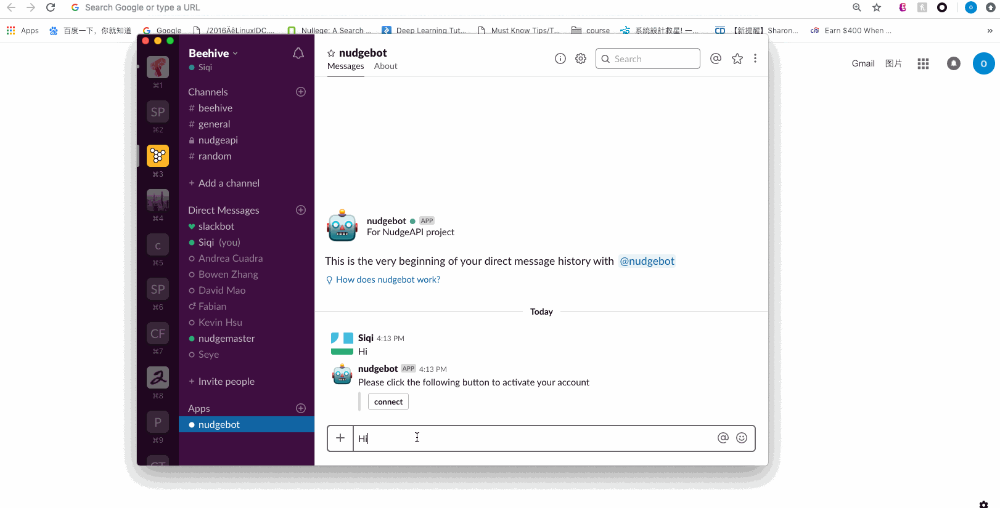
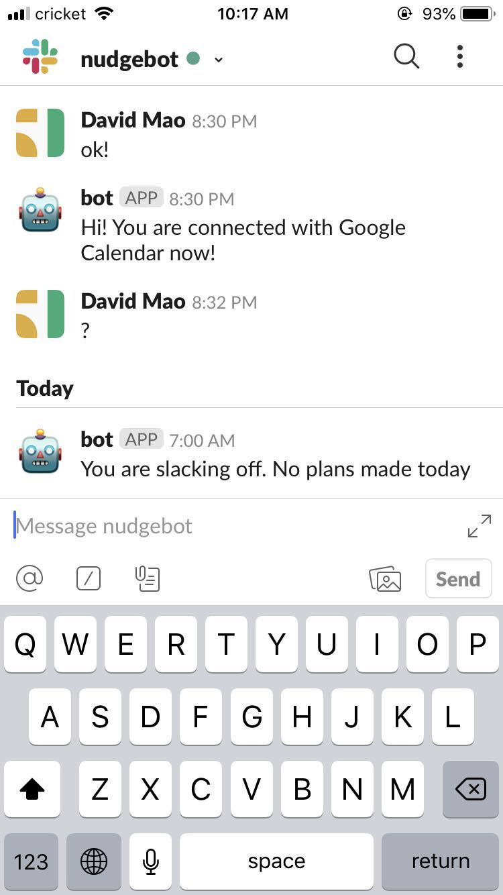

# Nudge Bot

### Purpose

The goal of this project is to drive behavior change by delivering personalized nudges that are informed by habitual patterns inferred from each user’s personal digital traces. Behavioral Economists define a nudge as an intervention that steers people in a particular direction but without forcing them to take an action. In this project, we will deliver digital nudges through slack.

### Overview

In this project, we will deliver digital nudges through slack.

This Nudge Bot is built using many asynchronous API's. The two core APIs used are Slackbots and Google Calendar API. The bot will start the conversation by explaining its functions and then request the permission to access the users' Google Calendar. If successfully connected, the bot would say that you are connected and tell the user that everyday at 7am, bot should check if users have any events planned on their calendar. Then send a message accordingly at 7am.


```Example:  
Bot: "Hi! This is nudge bot. We will inform you whether you have any event during the day at 7 am. Start with giving us permission to read your Google Calendar."
Bot: "Please click the following button to activate your account"
User: ...(Connecting)
Bot: "Congratulations! You are successfully connected to google calendar. Reminders for every day's events will come in 7 am."
User: "Thanks!"
Bot: "Hi! You are connected with Google Calendar now! Reminders for every day's events will come in 7 am."
(7 am)Bot: "You are slacking off. No plans made today." or "Fantastic job! You made plans today."
```

### Usage

#### Authenicating throught Google:


#### Checking events today:


## Set up

First you need to install node.js, which is what we use in this project. Instructions can be found [here.](https://medium.com/@js_tut/installing-node-js-on-pc-mac-and-linux-getting-started-with-react-from-scratch-ea24653e0ab4)

Then `npm install` to install the packages need.

After installing the packages you need, there are still some environment variables you need to set up to run this bot,

**DOMAIN**: *Heroku domain name*

**GOOGLE_CLIENT_ID**: *Google API Credentials*

**GOOGLE_CLIENT_SECRET**: *Google API Credentials*

**MONGODB_URI**: *Mongo DB credentials*

**NUDGE_BOT_TOKEN**: *Bot User OAuth Access Token*

**TZ**: America/New_York *The timezone you are in*

**NUDGE_BOT_TOKEN, DOMAIN**: You will need to create a slack bot and deploy it to heroku( or ngrok as long as it has domain name for the app to be registered in Google API), then get the token for the bot and domain name. Instructions on how to do this and set up environment variables in heroku can be found [here.](https://medium.com/@alexstroulger/how-to-build-a-slackbot-600635b12a38)

*Since the free version of Heroku has been used, the server will automatically sleep after 30 minutes. To prevent it from sleeping, I implemented a function in the code that will send a HTTP request every 10 minutes.*

**GOOGLE_CLIENT_ID, GOOGLE_CLIENT_SECRET**: Instructions on how to get Google Calendar API key can be found [here.](https://medium.com/@karanbhomia/integrating-google-calendar-api-to-web-app-using-serverless-node-js-functions-part-1-of-2-8a176595110b) The instructions also show why we need to deploy the app online and get a domain name for Google Calendar API.

**MONGODB_URI**: You will also need to set up a mongodb. Instructions on how to do this can be found [here](http://fredrik.anderzon.se/2017/01/17/setting-up-a-free-mongodb-database-on-mlab-and-connecting-to-it-with-node-js/). Use the URL mongodb://<dbuser>:<dbpassword>@\*.mlab.com:\*/\* as MONGODB_URI.

**TZ**: Set which time zone you would want the bot to be. List of tz database time zones can be found [here.](https://en.wikipedia.org/wiki/List_of_tz_database_time_zones)

Finally, set all of your environmental variables in heroku.

## Run

`npm start`

## Built With

* [Slackbots](https://www.npmjs.com/package/slackbots/) - Slack chat application
* [Google Calendar API](https://developers.google.com/calendar/) - Used by bot to read schedules
* [Express](https://expressjs.com/) - Backend Server

